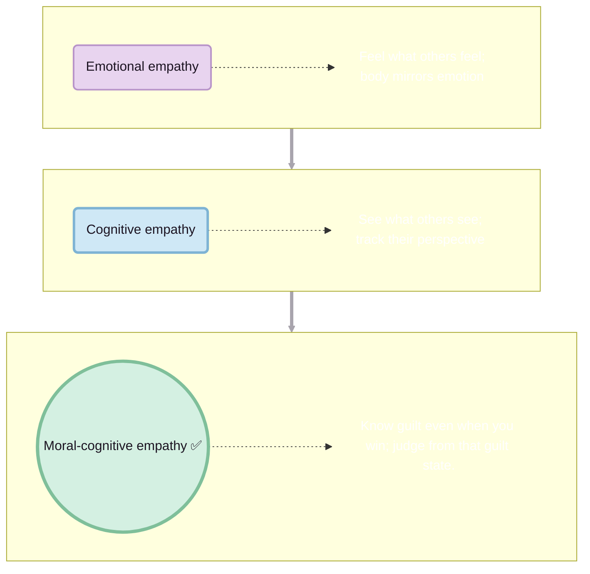

### Three kinds of “getting it”

Did you know when we ask young kids to share toys, they often cannot fathom why we ask? To them, the toy is theirs, the feeling is obvious, and the rule feels arbitrary.

Empathy is mostly learned, as the brain matures and social training stacks on top.

**Emotional empathy** → I feel what you feel (or what the herd is feeling). Seeing someone fall makes your stomach clench; tension in the house makes your body go tight before anyone speaks.

**Cognitive empathy** → I see what you see. I can track your point of view even if I do not share your feelings.

**Moral-cognitive empathy** → I know you could feel guilty even when you win, and I use that inner state to judge you.

### When the “inner judge” comes online

Most kids do not start with an inner judge. At 4 or 5, if you ask how a kid feels after breaking a rule and getting what they wanted, many will say he feels good because the outcome was good. “Wrong” is still about “did it work?” and not “what kind of person does this make me?”.

Somewhere around 7 to 8, the simulation upgrades. Now they expect a wrongdoer to feel bad even when they got the prize, and they rate a happy wrongdoer as worse than a sorry one. They are not just reading faces anymore; they are running a model of an internal courtroom, with guilt as a real state that matters.

### From “I get you” to “I will act”

On top of that sits social or compassionate empathy: I move from “I get you” to “I will act on this.” I share, protect, or intervene, not just because I feel it, but because “people like us do not do that to each other.”

### When the stack stops short

Many adults never fully stabilise the higher layers. They can copy the right expressions, say the right words, and play the remorse script on cue. Under the hood, they are still running outcome-centric code.

### How systems aim the beam

Systems know how to hijack that. They do not have to delete empathy; they only have to aim it. Dehumanise or vilify a target group, and your moral-cognitive empathy stops asking “should we feel guilty?” and starts asking “what should happen to them?” instead.
