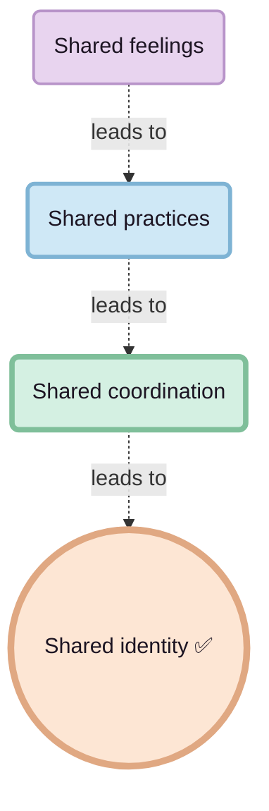

### How alignment stacks

### Language as zip

Language is what happens when you zip a whole mental universe into one thin line of text. Someone else unzips it with a different brain and never gets your exact state, only their reconstruction.

### Sentences as memes

Each sentence is basically a meme: a compressed pattern that their mind inflates into a full story, feeling, or frame. Change the brain and the decompression produces a different simulation, even if the words stay the same.

### Tribe and drift

This is where tribe shows up. You want synchronicity, you need to tune into each other. Share less life, and your meanings slowly split. Same words, different worlds.

### What you are actually buying

If you want people to “communicate better”, you have to be honest about what you’re actually buying. You don’t buy it with office days, gym perks, or forced socials. You buy it with real, low‑agenda time together, where nobody is secretly keeping score.
